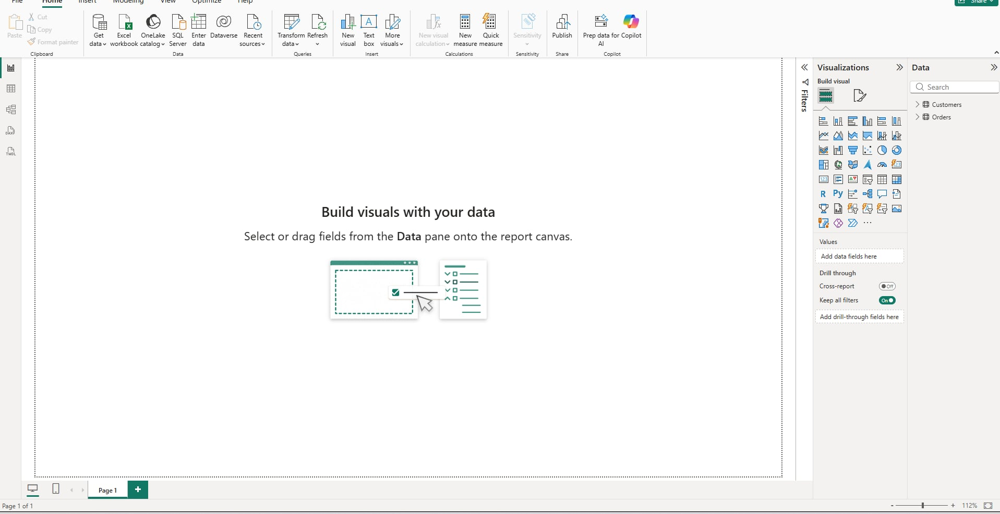

# 📊 Laboratory Work 2  
## End-to-End Data Analytics in Power BI: From Data Cleaning to DAX Insights

---

# Power Query – Data Cleaning

## 🎯 Lab Objectives

- Clean and prepare raw datasets
- Apply data transformation techniques in **Power Query**

---

# Open Power Query Editor

### Steps

1. Open **Power BI Desktop**
2. Click **Home → Get Data → Excel Workbook**
3. Select **Messy_Sales_Data.xlsx**
4. Click **Transform Data** to open **Power Query Editor**

### Screenshot

### Explanation

The **Power Query Editor** allows users to clean, transform, and prepare raw datasets before they are loaded into Power BI for analysis. It is an essential step in the data preparation process.

---

# Remove Duplicates

### Steps

1. Select the dataset table.
2. Highlight the **OrderID** column.
3. Click **Home → Remove Rows → Remove Duplicates**.

### Screenshot

### Explanation

Removing duplicates ensures that every **OrderID** represents a unique transaction. Duplicate data can lead to incorrect calculations, inaccurate reports, and misleading business insights.

---

# Handle Missing Values

### Methods Used

| Method | Description |
|------|------|
| Replace Values | Replace null values with `0` |
| Remove Blank Rows | Remove rows with missing data |
| Fill Down | Copy previous value downward |

### Steps

1. Identify columns containing **null values**
2. Apply appropriate transformation:
   - **Transform → Replace Values**
   - **Remove Rows → Remove Blank Rows**
   - **Transform → Fill → Down**

### Screenshot

### Explanation

Missing values can cause issues in reports and analytics. Handling them properly ensures the dataset remains accurate and usable.

---

# Change Data Types

### Correct Data Types

| Column | Data Type |
|------|------|
| Order Date | Date |
| Sales | Decimal Number |
| Quantity | Whole Number |

### Steps

1. Check the **data type icon** beside each column name.
2. Change to the appropriate type if necessary.

### Screenshot

### Explanation

Correct data types ensure Power BI performs calculations accurately and allows features such as time analysis and numeric aggregation.

---

# Rename Columns Properly

### Naming Convention

| Original Name | New Name |
|------|------|
| Order ID | `order_id` |
| Order Date | `order_date` |
| Customer Name | `customer_name` |
| Sales | `total_sales` |

### Screenshot

### Explanation

Using consistent naming conventions improves readability and makes it easier to write **DAX formulas, queries, and reports**.

---

# Applied Steps Screenshot

### Explanation

The **Applied Steps pane** records every transformation applied in Power Query. This allows analysts to review, modify, and reproduce the data cleaning process.

---

# Guide Questions

## 1. Why is removing duplicates important in data analysis?

Removing duplicates ensures that each record represents a unique transaction. Duplicate data can inflate totals, distort analytics, and lead to incorrect conclusions in reports.

---

## 2. What problems can missing values cause in reports?

Missing values may cause:

- Incorrect calculations
- Broken visualizations
- Misleading insights
- Errors in data aggregation

Handling missing values ensures reliable reporting.

---

## 3. How does correct data typing affect calculations?

Correct data types ensure Power BI performs appropriate operations. For example:

- **Date types** allow time-based analysis
- **Decimal numbers** support financial calculations
- **Whole numbers** support counting and aggregation

Incorrect data types may lead to errors or invalid calculations.

---

## 4. What naming conventions improve data readability?

Good naming conventions include:

- Use lowercase letters
- Use underscores instead of spaces
- Use descriptive column names

# Enhancement Activities

## Data Quality Checklist

A data quality checklist may include:

- Remove duplicate records
- Handle missing values
- Verify data types
- Standardize column names
- Validate data consistency
- Check numeric ranges

---

## Dataset Size Comparison

Cleaning the dataset reduces unnecessary data by removing duplicates and blank rows. This results in a more efficient dataset for analysis.

---

## Research: What is ETL?

ETL stands for:

| Stage | Description |
|------|------|
| Extract | Collect data from sources |
| Transform | Clean and process the data |
| Load | Store the processed data |

### Power Query and ETL

Power Query supports the **Transform** stage by allowing users to:

- Clean data
- Merge datasets
- Transform columns
- Standardize formats

This makes Power BI a powerful tool for data preparation.

---

# Merge and Append Queries

## 🎯 Lab Objectives

- Combine datasets using joins
- Understand the difference between **Merge** and **Append**

---

# Load Data

Datasets used:

- **Customers.csv**
- **Orders.csv**

### Steps

1. Click **Home → Get Data → Text/CSV**
2. Import both files
3. Open **Power Query Editor**

### Screenshot

---

# Merge Datasets (Inner Join)

### Steps

1. Select **Orders table**
2. Click **Home → Merge Queries**
3. Select **Customers table**
4. Match using **CustomerID**
5. Choose **Join Type → Inner Join**
6. Expand the merged columns

### Screenshot

### Explanation

An **Inner Join** returns only records where **CustomerID exists in both tables**. This ensures orders are matched with valid customers.

---

# Append Queries

### Steps

1. Click **Append Queries → Append as New**
2. Select multiple monthly sales tables
3. Confirm the append operation

### Screenshot

### Explanation

Append combines tables **vertically**, meaning rows from different tables are stacked together to create a single dataset.

---

# Validate Merged Data

After merging, validation was performed by checking:

- Row counts
- Null values
- Customer details

### Screenshot

### Explanation

Validation ensures that the merge process worked correctly and no unexpected data issues occurred.

---

# Guide Questions

## 1. What is the difference between Merge and Append?

| Feature | Merge | Append |
|------|------|------|
| Function | Combines tables using a key column | Stacks tables vertically |
| Similar To | SQL JOIN | SQL UNION |
| Usage | Combine related datasets | Combine similar datasets |

---

## 2. Why use Inner Join instead of Left Join?

An **Inner Join** ensures that only records with matching values in both tables are included. This prevents incomplete data from appearing in reports.

---

## 3. What happens to unmatched records in an Inner Join?

Unmatched records are excluded from the final result. Only rows with matching keys in both tables are returned.

---

## 4. When is Append more appropriate than Merge?

Append is appropriate when tables have the **same structure** but represent different datasets.

